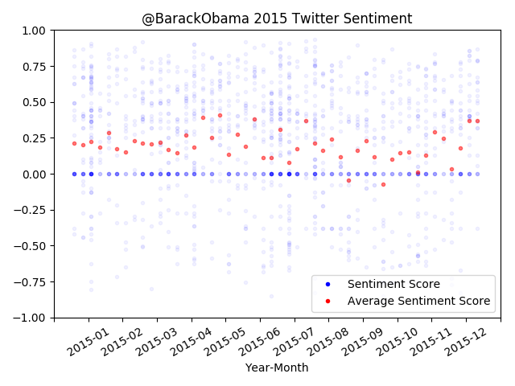

# Twitter Sentiment Analysis

## Introduction

A Twitter user's sentiment score (obtained by tweets) is plotted over time. A sentence with sentiment closer to 1 is 
"positive", and a sentence with sentiment closer to -1 is "negative". 

A sentence with a positive sentiment score would be "I love my work."<br/>
A sentence with a negative sentiment score would be "I hate my work."

On the plot, the months are broken up into 4 points. Using September as an example, we group Sept 1-8, Sept 9-16, 
Sept 17-24, and Sept 25-32 together.

The blue points are the sentiment score of a tweet. An opaque point is used for tweets to get an idea of density.

The red point is the average of each group. 

## Example

 <br/>

 <br/>

 <br/>

## Analysis

Barack Obama was in office January 20, 2009 – January 20, 2017. We are looking at Obama's tweets before and after he 
left office. November 2016 was also the month of the 58th American Presidential election where Trump won, and was also
the month Obama's twitter activity changes.

In November and December 2016, Obama does not tweet (or they are deleted). In 2017, his twitter is less active and the
average sentiment scores of his tweets are more varied.

## Installation

Get a twitter developer account from <a href="https://developer.twitter.com">developer.twitter.com</a> and fill in 
[authorization.py](authorization.py) with your consumer and access codes.

```
conda env create -f environment.yml
source activate sentiment_env
pip install -r requirements.txt
```

## Running

```
python3 sentiment_analysis.py @twitter_handle
```

For example, to run on BarackObama, 
```
python3 sentiment_analysis.py BarackObama
```
